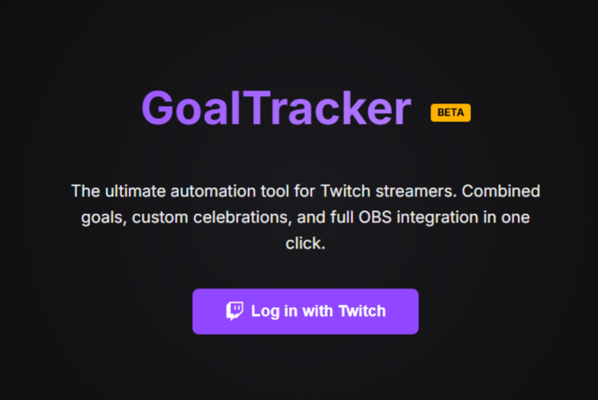
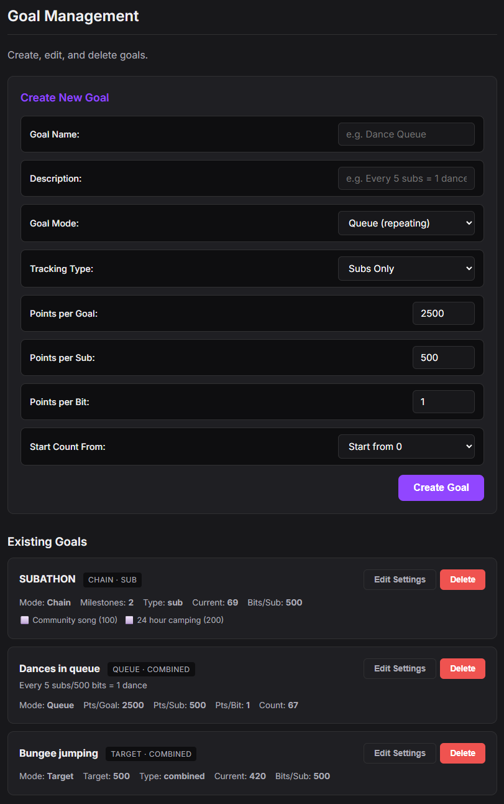
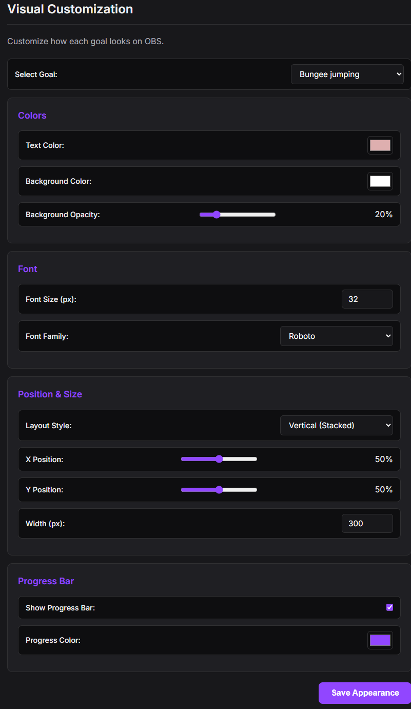
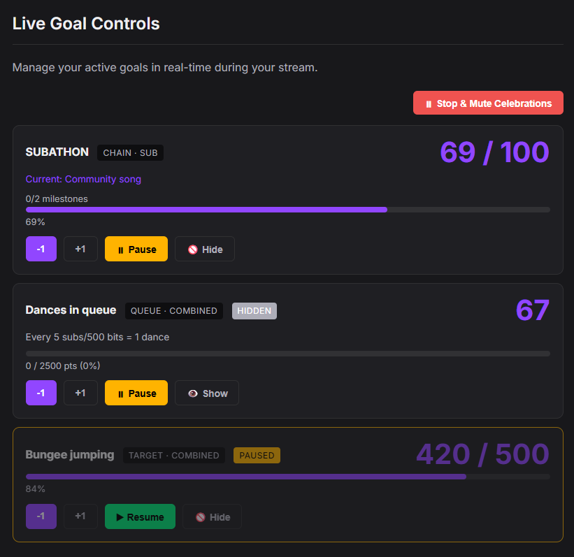
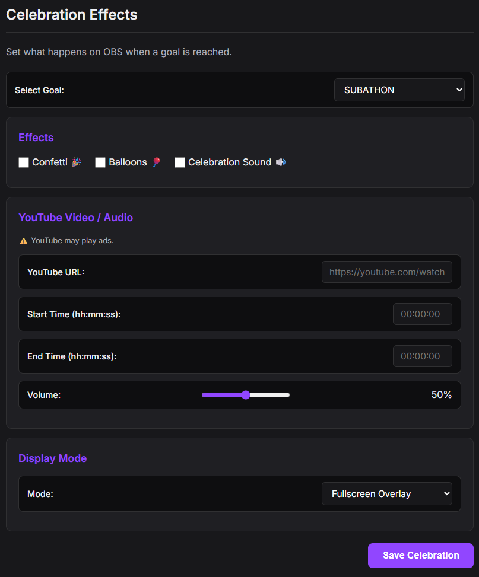
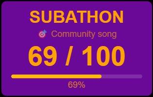
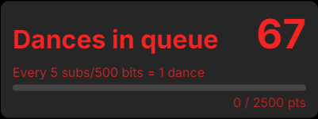
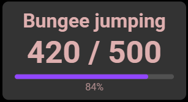
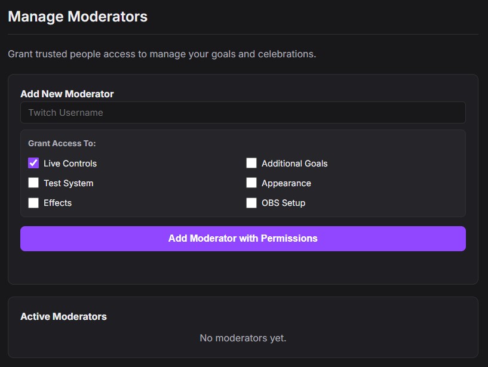

# 🚀 GoalTracker: A Simple Twitch Overlay Suite

GoalTracker is a real-time tool designed for Twitch streamers who want to bridge the gap between viewer milestones and on-stream visuals. From sub-goals to dynamic YouTube-integrated celebrations, GoalTracker provides everything you need to keep your community engaged.

[**🌐 Visit the Live App**](https://goaltracker-bd77a.web.app/) | [**💬 Submit Feedback**](https://github.com/sumsumdev/SimpleGoalTracker/issues)

---

## ✨ Core Features

### 🎯 Intelligent Goal Management

Create goals with ease. Whether you're running a **Subathon** with multiple milestones, tracking repeting goals like **100 pushups for 100 subs** or **50 pushups for 1000 bits**, or setting a **Bungee Jumping sub goal Target**, GoalTracker is for you.
- **Combined Tracking**: Support for Subs, Bits (with customizable conversion rates), and Milestones.
- **Dynamic Modes**: Choose between Chain (milestone-based), Queue, or Target modes.
- **Live Sync**: Start from your current value or set custom starting points instantly.

### 🎨 Deep Visual Customization

Make your goals look like part of your brand. Our visual editor gives you full control over every pixel of your OBS overlay.
- **Color & Opacity**: Customize text, background, and progress bar colors with precise opacity control.
- **Typography**: Choose from a library of fonts (like Roboto) and adjust sizes for maximum readability.
- **Layout Styles**: Toggle between different layout modes (Vertical Stacked, Horizontal, etc.) to fit your scene.

### 🕹️ Real-Time Live Controls

Manage your stream's energy without breaking your flow. The dashboard gives you full control over every active goal.
- **Instant Adjustments**: Manually add or subtract progress with a single click.
- **Pause & Hide**: Temporarily take goals off-screen or pause tracking during breaks.
- **Global Mute**: One-click "Stop & Mute" for all active celebrations when things get too loud.

### 🎊 Advanced Celebration Engine

Turn every milestone into a show. GoalTracker's celebration engine allows using YouTube links as visual or audio-only celebrations.
- **YouTube Integration**: Trigger specific clips or videos with custom Start/End times and volume control.
- **Visual Effects**: Built-in Confetti, Balloons, and sound trigger.
- **Custom Positioning**: Precise positioning and scaling for OBS overlays to fit your layout perfectly.

---

## 📸 Live Overlay Showcase
See how GoalTracker looks in action across different stream setups:

| Subathon Milestone | Repeating Queue | High-Stakes Target |
| :---: | :---: | :---: |
|  |  |  |

---

### 🛡️ Moderation Access

Delegate safely. Grant your trusted team members access to specific parts of your dashboard without sharing sensitive keys.
- **Permission-Based Access**: Toggle access for Live Controls, Effects, Appearance, and OBS Setup.

---

## 🛠️ Technical Highlights
*   **Real-Time Sync**: Built on Firebase for real-time data propagation to OBS.
*   **Responsive Dashboard**: Working on Desktop, Tablet, and Mobile.

---

## 🤝 Join the Beta
GoalTracker is currently in **Beta**.

**Have a feature idea or found a bug?**
[**Open a GitHub Issue**](https://github.com/sumsumdev/SimpleGoalTracker/issues) and help us shape the tool!
